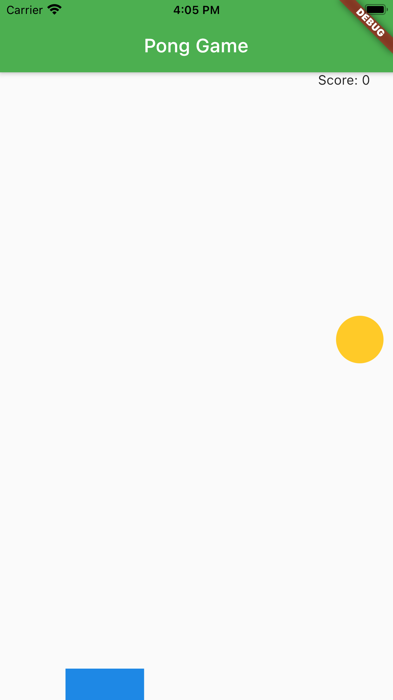
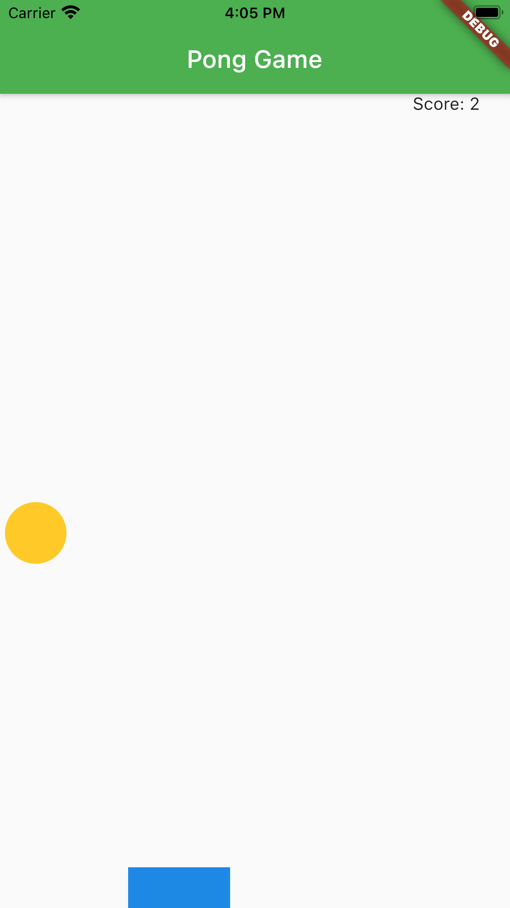
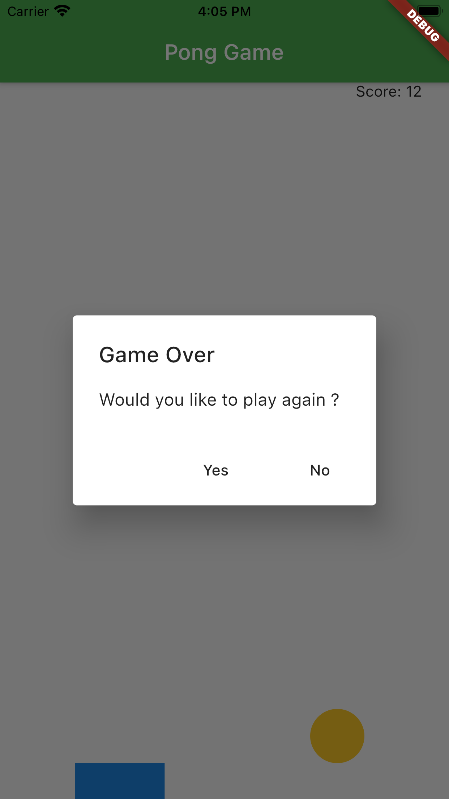

# Pong-Game
**Pong is a table tennis–themed arcade sports video game, featuring simple two-dimensional graphics, originally released in 1972.**
<h2>Functionality</h2>
<p>A simple game, based on animations and on detecting a user's gestures</p>
<p>Animations in Flutter are fast and relatively easy to implement. The moving parts involved
in the animation are the Animation class, which takes in some values and translates them
into animations, AnimationController, which controls the animation objects, Tween,
which contains the value of the property that needs to change during the animation, and
Ticker, which calls its callback once per animation frame.</p>
<p>Enclosing any widget in a GestureDetector will allow to listen to several gestures
the user performs over the user interface. This allowed the moving bat to be constructed on
the screen, leveraging the onHorizontalDragUpdate property of GestureDetector.</p>
<p>Adding some randomness generally makes a game more interesting. The Random class is used to generate a random integer value with the nextInt method.</p>

<h2>Installations</h2>

```
Download the Code
```
<li>Run</li>

```
flutter run
```
<h2>ScreenShots & SnapShots</h2>

<h4><li> Home Screen</li> </h4>



<h4><li>Counting the Score</li> </h4>



<h4><li>Game Over Dialogue Box</li> </h4>



